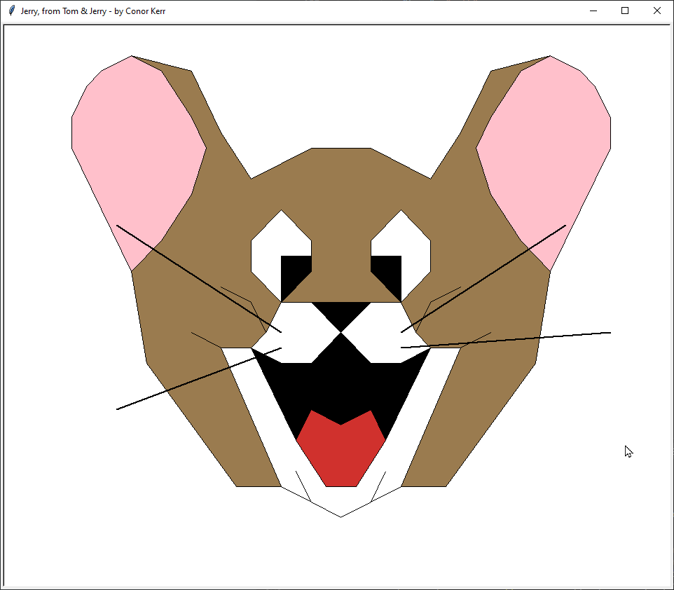
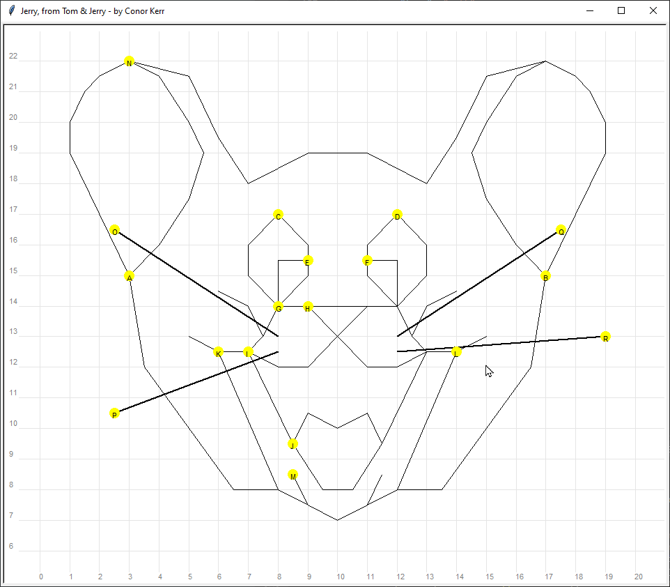
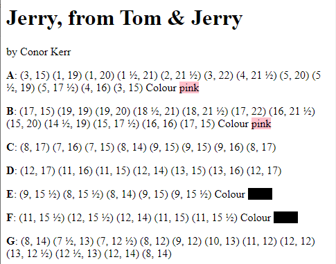
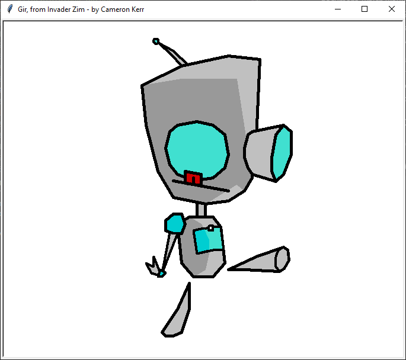

# XYpics ('ix-ee-pics') makes simple pictures using co-ordinates and JSON

This started as a homework assignment for my 9-year-old son, Conor. Create a picture of a cartoon character by giving a list of X-Y coordinates. After studiously (and very accurately, as it turned out) filling 1.5 pages of mathematics paper with coordinates, I was asked to please enter it into the computer (because, you know, tedious). There was no computer as part of this assignment, although the resulting set of co-ordinates needed to be entered online in a Google Doc



But what if there was a mistake? How can you test what you have done? How can you quickly test your corrections and fine-tuning? Can we speed that development loop? All of these are questions I thought would be useful to investigate with my son.

# How to use this software

There are two scripts, `draw.py` and `prettyprint.py`. The main script is `draw.py`, which as the name suggests, draws the picture. The script `prettyprint.py` makes a **very** simple HTML version which you could open in a browser, and copy-paste into the likes of a word processor such as Google Docs. The HTML file is written next to the input file, but with a .html extension.

You will need Python installed; at least version 3.6 or later; although I've only tested with Python 3.9.2 on Windows at this stage, it *should* work anywhere Python does, so long as it has a desktop to display on.

On Windows, run it as follows in a terminal (Powershell or cmd.exe):

```
python draw.py pictures\jerry.json
python draw.py --draw-grid pictures\jerry.json
python prettyprint.py pictures\jerry.json
```

On Linux or Mac OS, run it as follows in a terminal:

```
python draw.py pictures/jerry.json
python draw.py --draw-grid pictures/jerry.json
python prettyprint.py pictures/jerry.json
```

The most useful option is `--draw-grid`; it's particularly useful when dealing with filled areas. When `--draw-grid` is in effect you will get gridlines, but also no filling with be used; thus you can easily see when things that should coincide, do not.

Another option that will be particularly useful when checking is `--draw-labels`, but note that if two labels coincide, you will only see the later one.



Things to keep in mind (in no particlur order, and not well structured, sorry)

* The easiest way to figure out the structure of the file is to look at either pictures/jerry.json or pictures/gir.json (jerry.json is simpler; gir.json shows more features and tricks).
* Elements are drawn in order; thus later elements will overlap others. This can be used creatively to simplify some drawings.
* You are not limited to a resolution of 0.5; you could specify a value as fine as you need; this is particularly useful when doing finer details, when using a resolution of 0.1 is often useful (see gir.json in the antenna, or wrist)
* Turtle graphics doesn't have a way to turn off stroke width; a stroke width of 0 will still be seen. I worked around it by making the `pen_color` the same as the `fill_color`, but there is a feature that could added (see the last section)
* Shadows can be achieved with some slight-of-hand;
  1. Create a `filled_shape` for the base you want to cast a shadow on. Let's say the `fill_color` is 'turquiose'
  2. Create another `filled_shape` for the shadow you want to cast on it. Make the version a darker version, eg. 'dark turquiose'
  3. If you care for a thick outline, repeat the base shape (#1 above) but as a `path` instead of a `filled_path`. This is because the shadow will overwrite half of the penstroke made in #1.
* The colours names used are known as ['Tk' colours](https://wiki.tcl-lang.org/page/Colors+with+Names), but you can also use HTML/CSS RGB colours, and using an [HTML colour picker](https://www.google.com/search?q=html+color+picker) is recommended, expecially for colours like 'brown', or even 'red', which are unlikely to match what the picture creator had in mind.
* There is no ability yet to write the image to a file; instead you will need to take a screenshot and save that as you like. On Windows, I tend to use a tool called Greenshot for this, although I think Windows 10 has something decent out of the box now.
* If you click on the picture the coordinate (rounded to the nearest 0.5) will be printed to the output terminal. You won't see anything on screen, but it will be useful to quickly 'rough out' a new element ready for fine-tuning.
* For debugging, you may find it useful to make `pen_color` and perhaps also `pen_size` temporarily different, and perhaps use `--draw-grid`.

Finally:

* This is *not* meant to be a proper image creation program; it's an opportunity to explore concepts in coding in what is hopefully a fun way.

# A story of development

## How to represent your input?

My wife is studing Data Analytics, and my son, Conor, is into a bit of programming, so I thought it would be useful to include some real-life handling of data. I chose JSON. I could have chosen YAML instead, which has some significant advantages (particularly around referencing and reusing parts of the document, which would have been helpful in gir.json). Biggest awkwardness in both JSON and YAML is how to represent a co-ordinate. Neither have a notion of a pair tuple, so I just modelled a coordinate as a list of two elements.

Conor's picture had a number of elements (about 'Q' or them) that made up the picture, and some were paths, and some were filled. So the data format needed to be extensible so I could add features (eg. stroke width and colour, or even a comment field, as JSON doesn't allow comments).

```json
{
    "name": "Jerry, from Tom & Jerry",
    "author": "Conor Kerr",
    "world_coordinates": {
        "llx": -1, "lly": 5, "urx": 21, "ury": 23
    },
    "elements": [
        {
            "id": "A",
            "type": "filled_path",
            "fill_color": "pink",
            "coords": [
                [3, 15], [1, 19], [1, 20], [1.5, 21], [2, 21.5],
                [3, 22], [4, 21.5], [5, 20], [5.5, 19], [5, 17.5],
                [4, 16], [3, 15]
            ]
        },
        ...
        {
            "id": "C",
            "type": "path",
            "coords": [
                [8, 17], [7, 16], [7, 15], [8, 14], [9, 15],
                [9, 15], [9, 16], [8, 17]
            ]
        },
        ...
```

It just so happens that Conor set his list of coordinates for filled shapes in a way that agreed with how Turtle graphics filled shapes.

## How to draw the program?

Python obviously has an easy `json` library for using JSON, and for graphics, I kept it simple and just used the `turtle` module. Normally with Turtle Graphics you use commands like forward and turn, but you can also use goto to implement simple cartesian coordinates.

Turtle graphics also has the middle of the picture as (0,0), but Conor's drawing had (0,0) at the bottom-left, so we need a way to set the world coordinates, which needs to be a square, because the Turtle screen is square.

Conor started with a drawing on mathematics grid paper. If you were wanting to make corrections after you had edited it, it would be useful to have some gridlines.

I also added labels to show the start of each component, but labels will overlap earlier labels if they coincide.

As we were iterating over getting all the coordinates I added a feature for setting the speed of the Turtle. Still slower than I wanted though.

## A nicer report format

Conor wanted to have a nicer-looking format, and wasn't pleased to hand in a JSON file. Fair enough... although he was mostly annoyed that the coordinated had decimals, like 31.5 rather than 31 ½.

Another problem, another opportunity to illustrate data processing.



## A story in accelerating the development cycle

Now apparently it my turn to make a picture. A good opportunity to demonstrate speeding up the development cycle. I ended up adding some features as I was making my own creation, such as:

* adding a `comment` field so I could keep track of what was what;
* adding a `pen_size` and `pen_color` field so I could do laborious-but-cool tricks like shadows;
* added an on-click handler so it would print out the coordinate in the style I wanted (rounded to closest 0.5) -- see the Conundrum section below;
* found out how to make Turtle draw the whole picture without any delays;
* added a timer to check if the JSON file had changed every second, and redraw it if it has.



## A Conumdrum

To discuss: given I implemented a click-to-report-the-coordinates mechanism, am I cheating, or am I working smarter, not harder?

## Requirements

* Python > 3.6   (I used Python 3.9 on Windows with no additional libraries)
* An programmers text-editor that will show syntax errors for JSON:
  * Visual Studio Code does an excellent job
  * Notepad++ doesn't show syntax errors, but is otherwise good
  * Avoid anything like Notepad or TextEdit

## Want to go further?

Here's some ideas for further development. I wouldn't say the development of these features are child-friendly, but the use of these features could be useful pedagogically.

* Here's an easy bug to fix; When `pen_width` is 0, lift the turtle's tail so its trail is not visible; otherwise Turtle graphics will still show a (thin) line.
* Use YAML instead of JSON. If I do that, then JSON input would still work, as a JSON document is automatically valid YAML, although the reverse is not true. Demonstrate how we can borrow from some useful YAML features such as 'node anchors' and 'node references' which allow reusing parts of the document (eg. in gir.json, there are multiple examples where a fill, then a partial shadow, then an outline share a significant portion of coordinates that would otherwise have to be kept in sync)
* Compare making a bespoke Domain Specific Language, to demonstrate what new concerns our program would have to take on.
* Use JSON schemas, as used in projects such as Kubernetes, to help make our code more robust and provide better error messages when the JSON/YAML is not well-structured.
* Refactor the code to have multiple turtles, rather than using the global turtle.
* Demonstrate the concept of abstraction, reuse and recursion by allowing a picture to include another picture.
* Demonstrate the concept of a pipeline by automating saving the image (Python turtle library doesn't have this itself, but its apparently possibly to export to EPS format by using the underlying Tk library... and then converting the EPS format to something more useful).
* Combine the resulting image in a pipeline that creates a meme generator, or puts text around it, or makes it transparent, or ....
* Change the media! Make a version that outputs something for the web (is there are a Javascript turtle library?), or even a CNC laser edition.... or a robot controlled turtle whose tail draws in the sand!
* Send your digital art for to a photo-printing service and get your art on a mug, a card, a fridge magnet, etc.
* If you want to play with HTML, you could do a nicer job than I have done with prettyprint.py. Maybe include the screenshot and a version with the gridlines too.
